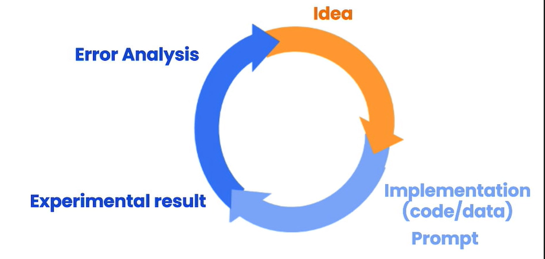
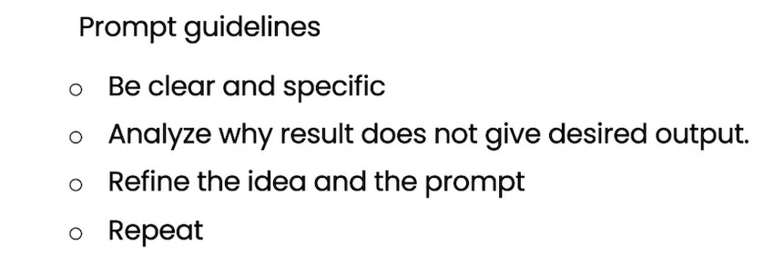
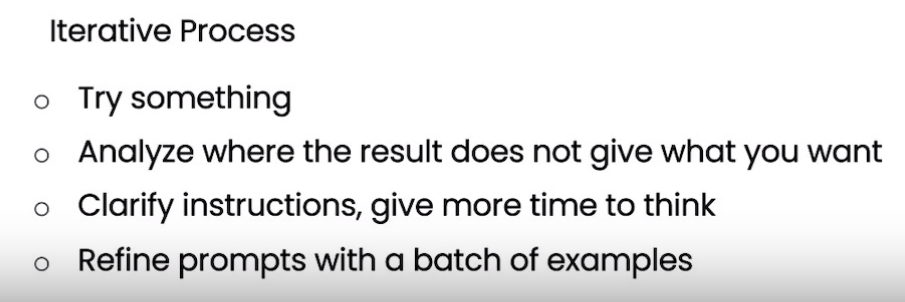

# Lesson3: Iterative Prompt Development

## Overview

In this lesson, you'll iteratively `analyze` and `refine` your prompts to generate **marketing copy** from a product fact sheet.

## Iterative Prompt Development Process



### Recall Guidelines  




### Application example : Generate a marketing product description from a product fact sheet

```python
fact_sheet_chair = """
OVERVIEW
- Part of a beautiful family of mid-century inspired office furniture, 
including filing cabinets, desks, bookcases, meeting tables, and more.
- Several options of shell color and base finishes.
- Available with plastic back and front upholstery (SWC-100) 
or full upholstery (SWC-110) in 10 fabric and 6 leather options.
- Base finish options are: stainless steel, matte black, 
gloss white, or chrome.
- Chair is available with or without armrests.
- Suitable for home or business settings.
- Qualified for contract use.

CONSTRUCTION
- 5-wheel plastic coated aluminum base.
- Pneumatic chair adjust for easy raise/lower action.

DIMENSIONS
- WIDTH 53 CM | 20.87”
- DEPTH 51 CM | 20.08”
- HEIGHT 80 CM | 31.50”
- SEAT HEIGHT 44 CM | 17.32”
- SEAT DEPTH 41 CM | 16.14”

OPTIONS
- Soft or hard-floor caster options.
- Two choices of seat foam densities: 
 medium (1.8 lb/ft3) or high (2.8 lb/ft3)
- Armless or 8 position PU armrests 

MATERIALS
SHELL BASE GLIDER
- Cast Aluminum with modified nylon PA6/PA66 coating.
- Shell thickness: 10 mm.
SEAT
- HD36 foam

COUNTRY OF ORIGIN
- Italy
"""

prompt = f"""
Your task is to help a marketing team create a 
description for a retail website of a product based 
on a technical fact sheet.

Write a product description based on the information 
provided in the technical specifications delimited by 
triple backticks.

Technical specifications: ```{fact_sheet_chair}```
"""
response = get_completion(prompt)
print(response)

```

`Completion : `

```
Introducing our stunning mid-century inspired office chair, the perfect addition to any home or business setting. Part of a beautiful family of office furniture, including filing cabinets, desks, bookcases, meeting tables, and more, this chair is available in several options of shell color and base finishes to suit your style. Choose from plastic back and front upholstery (SWC-100) or full upholstery (SWC-110) in 10 fabric and 6 leather options.

The chair is constructed with a 5-wheel plastic coated aluminum base and features a pneumatic chair adjust for easy raise/lower action. It is available with or without armrests and is qualified for contract use. The base finish options are stainless steel, matte black, gloss white, or chrome.

Measuring at a width of 53 cm, depth of 51 cm, and height of 80 cm, with a seat height of 44 cm and seat depth of 41 cm, this chair is designed for ultimate comfort. You can also choose between soft or hard-floor caster options and two choices of seat foam densities: medium (1.8 lb/ft3) or high (2.8 lb/ft3). The armrests are available in either an armless or 8 position PU option.

The materials used in the construction of this chair are of the highest quality. The shell base glider is made of cast aluminum with modified nylon PA6/PA66 coating and has a shell thickness of 10 mm. The seat is made of HD36 foam, ensuring maximum comfort and durability.

This chair is made in Italy and is the perfect combination of style and functionality. Upgrade your workspace with our mid-century inspired office chair today!

```


## Issue 1: The text is too long 
- Limit the number of words/sentences/characters.

## Issue 2. Text focuses on the wrong details
- Ask it to focus on the aspects that are relevant to the intended audience.


## Issue 3. Description needs a table of dimensions
- Ask it to extract information and organize it in a table.

## Solution : 

Check the following [notebook](./lab/l3-iterative-prompt-development.ipynb) to see the solutions


## Summary




## References

Main course : 
- https://learn.deeplearning.ai/chatgpt-prompt-eng/lesson/3/iterative


