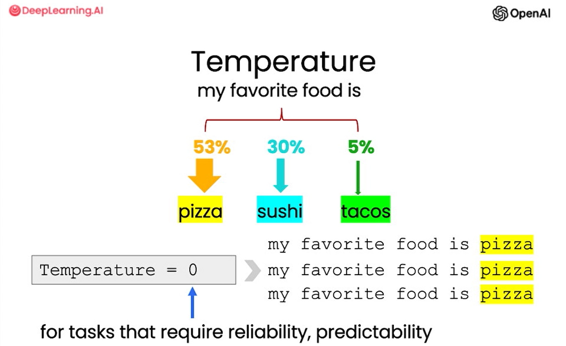
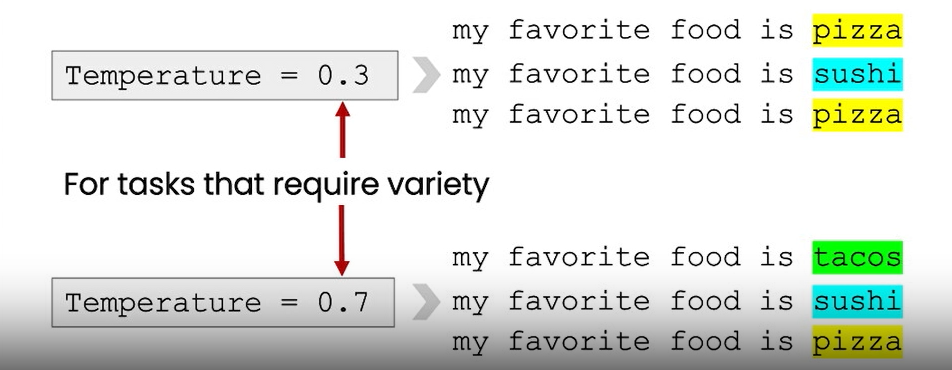

# Lesson7: Expanding


## Overview

In this lesson, you will generate customer service emails that are tailored to each customer's review.

### Warnings & good usage

- Expanding can be used to generate a large amount of spam. 
- It's strongly advised to use AI & LLMs in a responsible way or in a way that helps people.

### Customize the automated reply to a customer email

```python
# given the sentiment from the lesson on "inferring",
# and the original customer message, customize the email
sentiment = "negative"

# review for a blender
review = f"""
So, they still had the 17 piece system on seasonal \
sale for around $49 in the month of November, about \
half off, but for some reason (call it price gouging) \
around the second week of December the prices all went \
up to about anywhere from between $70-$89 for the same \
system. And the 11 piece system went up around $10 or \
so in price also from the earlier sale price of $29. \
So it looks okay, but if you look at the base, the part \
where the blade locks into place doesn’t look as good \
as in previous editions from a few years ago, but I \
plan to be very gentle with it (example, I crush \
very hard items like beans, ice, rice, etc. in the \ 
blender first then pulverize them in the serving size \
I want in the blender then switch to the whipping \
blade for a finer flour, and use the cross cutting blade \
first when making smoothies, then use the flat blade \
if I need them finer/less pulpy). Special tip when making \
smoothies, finely cut and freeze the fruits and \
vegetables (if using spinach-lightly stew soften the \ 
spinach then freeze until ready for use-and if making \
sorbet, use a small to medium sized food processor) \ 
that you plan to use that way you can avoid adding so \
much ice if at all-when making your smoothie. \
After about a year, the motor was making a funny noise. \
I called customer service but the warranty expired \
already, so I had to buy another one. FYI: The overall \
quality has gone done in these types of products, so \
they are kind of counting on brand recognition and \
consumer loyalty to maintain sales. Got it in about \
two days.
"""
```

```python
prompt = f"""
You are a customer service AI assistant.
Your task is to send an email reply to a valued customer.
Given the customer email delimited by ```, \
Generate a reply to thank the customer for their review.
If the sentiment is positive or neutral, thank them for \
their review.
If the sentiment is negative, apologize and suggest that \
they can reach out to customer service. 
Make sure to use specific details from the review.
Write in a concise and professional tone.
Sign the email as `AI customer agent`.
Customer review: ```{review}```
Review sentiment: {sentiment}
"""
response = get_completion(prompt)
print(response)
```

`Completion:`

Check the [notebook](./lab/l7-expanding.ipynb) to see the final result.


### Model responses tuning? 

- Using `Temperature` parameter allows you to vary the degree of exploration and the variety of the variety of the model's responses.

Temperature = `0`
- for tasks that require realiability, predictiblity 



Temperature = `0.3 - 0.7`
- For tasks that require variety



- We set the temperature to 0.7, which will change the variety/randomness of the model's responses.


### Remind the model to use details from the customer's email 

```python
prompt = f"""
You are a customer service AI assistant.
Your task is to send an email reply to a valued customer.
Given the customer email delimited by ```, \
Generate a reply to thank the customer for their review.
If the sentiment is positive or neutral, thank them for \
their review.
If the sentiment is negative, apologize and suggest that \
they can reach out to customer service. 
Make sure to use specific details from the review.
Write in a concise and professional tone.
Sign the email as `AI customer agent`.
Customer review: ```{review}```
Review sentiment: {sentiment}
"""
response = get_completion(prompt, temperature=0.7)
print(response)
```


`Expected Completion:` 

```
Dear valued customer,

Thank you for taking the time to leave a review about our product. We are sorry to hear that you experienced a price increase and issues with the quality of the product. We apologize for any inconvenience this may have caused you.

Please know that we take all feedback seriously and we would like to assist you further. If you have any other concerns, please do not hesitate to reach out to our customer service team who will be more than happy to assist you.

Thank you again for your honest review and we hope to have the opportunity to serve you better in the future.

Best regards,

AI customer agent
``` 

## Notebook

Check the [notebook](./lab/l7-expanding.ipynb) to see the examples for each of those tasks above.


## References

Main course : 
- https://learn.deeplearning.ai/chatgpt-prompt-eng/lesson/7/expanding

LLM Parameters Demystified: Getting The Best Outputs from Language AI : 
- https://txt.cohere.com/llm-parameters-best-outputs-language-ai/