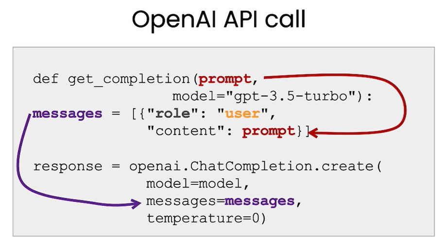
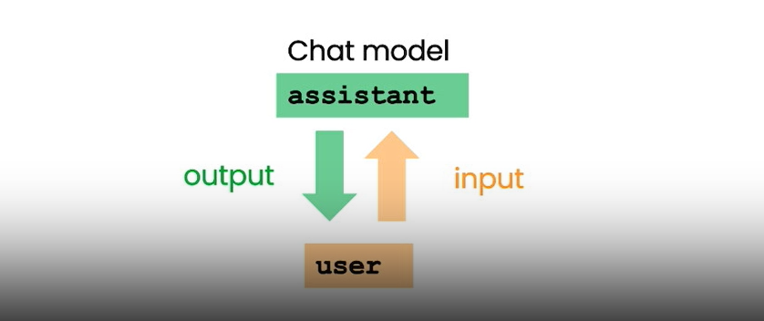
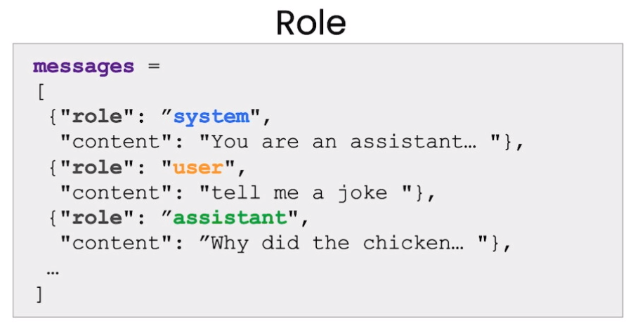
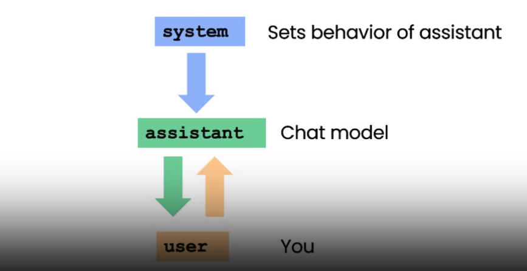

# Lesson8: Chatbot

## Overview

In this notebook, you will explore how you can utilize the chat format to have extended conversations with chatbots personalized or specialized for specific tasks or behaviors.

## OpenAI API call Architecture

- Getting response from a single prompt/message : 



- Chat model



### Setting multiple roles

In this lesson we're going to actually use a different helper function and instead of kind of putting a single prompt as input and getting a single completion, we're going to pass in a `list of messages` and these messages can be kind of from a variety of different roles

```python
def get_completion_from_messages(messages, model="gpt-3.5-turbo", temperature=0):
    response = openai.ChatCompletion.create(
        model=model,
        messages=messages,
        temperature=temperature, # this is the degree of randomness of the model's output
    )
#     print(str(response.choices[0].message))
    return response.choices[0].message["content"]
```


- The `system` message is a high-level instruction which sets the behavior of the assistant 
- The `user` message give the user instruction
- The `Assistant` the model completion




### Improvement interaction using context!

If you want the model to draw from, or quote, unquote remember earlier parts of a conversation, you must provide the earlier exchanges in the input to the model. And so we'll refer to this as `context`

```python
messages =  [  
{'role':'system', 'content':'You are friendly chatbot.'},
{'role':'user', 'content':'Hi, my name is Isa'},
{'role':'assistant', 'content': "Hi Isa! It's nice to meet you. \
Is there anything I can help you with today?"},
{'role':'user', 'content':'Yes, you can remind me, What is my name?'}  ]
response = get_completion_from_messages(messages, temperature=1)
print(response)
```

`Completion : `

```
Your name is Isa.
```


## Building a OrderBot for a restaurant

We can automate the collection of user prompts and assistant responses to build a OrderBot. The OrderBot will take orders at a pizza restaurant.

- Check the [notebook](./lab/l8-chatbot.ipynb) to see the entire implementation.


## References

Main course : 
- https://learn.deeplearning.ai/chatgpt-prompt-eng/lesson/8/chatbot

Transformer paper - Attention is all you need:
- https://arxiv.org/pdf/1706.03762.pdf


